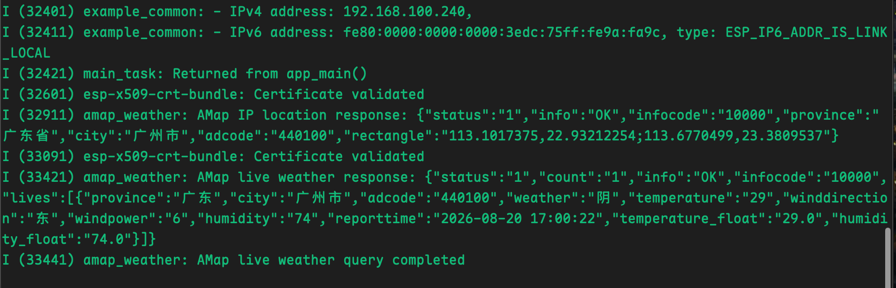
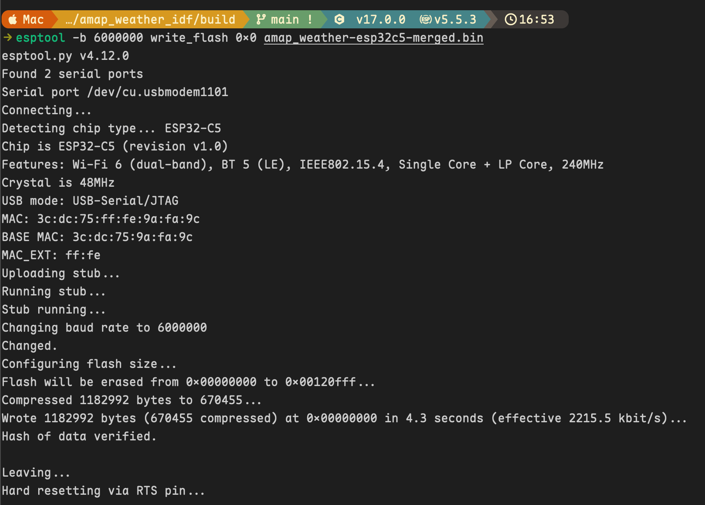

# ESP-IDF 高德自动定位以及天气查询

[](https://github.com/Orionxer/amap_weather_idf/actions/workflows/firmware-release.yml)
[](./LICENSE)
[](https://github.com/Orionxer/amap_weather_idf)
[](https://github.com/espressif/esp-idf/releases/tag/v5.5.3)


> [!Note]
> 实现ESP32-C5连接WiFi后，通过[高德IP定位接口](https://lbs.amap.com/api/webservice/guide/api/ipconfig)自动获取城市定位和[高德天气查询接口](https://lbs.amap.com/api/webservice/guide/api/ipconfig)查询当地实况天气。

## 环境准备
- ESP-IDF v5.5.3
- ESP32-C5

## 编译烧录

克隆工程
```
git clone https://github.com/Orionxer/amap_weather_idf.git
```

进入工程目录后，激活虚拟环境
```sh
source ~/.espressif/tools/activate_idf_v5.5.3.sh
```

设置芯片
```sh
idf.py set-target esp32c5
```

进入配置后进行以下设置
- 在 `Example Connection Configuration` 中配置 Wi-Fi。工程默认使用SSID `VTK`、密码 `AA12345678@`
- 在 `AMap Weather Configuration` 中配置 `AMap Web Service API Key`。
```sh
idf.py menuconfig
```

一键编译烧录以及监控
```sh
idf.py build && idf.py -b 6000000 flash && idf.py monitor
```

以下截图显示网络连接成功之后，请求高德IP定位接口和天气接口成功。



## 合并固件烧录

> 请自行查找乐鑫文档，准备好可以烧录的环境，Windows使用 `esptool.exe` , Mac/Linux使用 `esptool` 命令 

进入 [最新发布页面](https://github.com/Orionxer/amap_weather_idf/releases/tag/latest)，下载固件 **amap_weather-esp32c5-merged.bin**，该固件已合并，烧录地址从 `0x0` 开始。

烧录命令如下，根据实际情况调整参数
```sh
esptool --chip esp32c5 -b 6000000 write_flash 0x0 amap_weather-esp32c5-merged.bin
```



> [!Important]
> 通过此方式烧录合并固件，需要你确保附近有menuconfig中默认的Wi-Fi SSID及对应的Password，否则设备无法联网

## 请求流程

1. 请求 `https://restapi.amap.com/v3/ip`。
2. 校验高德公共字段 `status`，并读取非空 `adcode`。
3. 定位失败时使用默认 `adcode=440100`。
4. 请求 `https://restapi.amap.com/v3/weather/weatherInfo`
5. 校验 `status` 和非空 `lives` 数组，原样记录高德 JSON 响应。

### 关闭证书有效期校验
工程关闭了 mbedTLS 的证书有效期时间校验，因此 HTTPS 请求不依赖 SNTP 校时。但是，通用 CA 证书包 **esp_crt_bundle_attach** 仍用于验证服务器证书链和域名。

## python测试

运行python测试文件，测试高德接口是否正常
```sh
python3 amap_weather.py
```

## 开源协议

本项目基于 [MIT License](./LICENSE) 开源。

## 参考
- [高德IP定位接口文档](https://lbs.amap.com/api/webservice/guide/api/ipconfig)
- [高德天气查询接口文档](https://lbs.amap.com/api/webservice/guide/api-advanced/weatherinfo)
